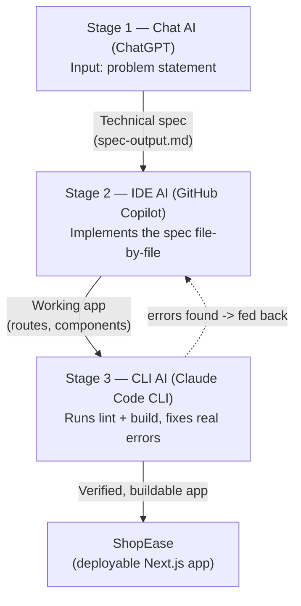

# ShopEase

ShopEase is a small e-commerce storefront built with **Next.js**, **TypeScript**,
and **Tailwind CSS**. It lets users browse a product catalog, view product
details, manage a cart, and complete a simple checkout flow.

## AI Workflow — Multi-Stage AI Workflow Across UX Types

This project is the deliverable for the **Multi-Stage AI Workflow Across UX
Types** lab. It chains **three** different AI UX types — chat, IDE, and CLI —
where the output of each stage is the literal input to the next.

| Stage | UX type | Tool used here (swap freely) | Input | Output |
|---|---|---|---|---|
| 1 | Chat | ChatGPT | One-line problem statement | `workflow/01-chat-stage/spec-output.md` (technical spec) |
| 2 | IDE | GitHub Copilot in VS Code | The spec from Stage 1 | Working Next.js app (`app/`, `components/`, `lib/`) |
| 3 | CLI | Claude Code CLI | The app from Stage 2 + non-functional requirements from Stage 1 | Lint/build-clean codebase, verified by `workflow/03-cli-stage/verify.sh` |

### Workflow diagram



Each stage's exact prompt, its raw output, and — for Stage 3 — a real
before/after log of errors found and fixed live under `workflow/`:

- `workflow/01-chat-stage/` — the spec-generation prompt and its output
- `workflow/02-ide-stage/` — how the spec was implemented, and what gap it left
- `workflow/03-cli-stage/` — the verification prompt, `verify.sh`, and a real
  before/after log (3 lint errors + 1 build failure found and fixed)

### Why a third stage was added

The lab's prerequisites and required-tools sections both call for a
CLI-based AI tool in addition to chat and IDE tools, but the original
version of this project only chained Chat → IDE. That two-stage version
also had no verification step, so "Functionality: runs end-to-end without
breaking" was only ever asserted, never actually checked — and it turned
out not to be true: `npm run lint` had 3 real errors and `npm run build`
failed outright (see `workflow/03-cli-stage/before-after-log.md` for the
exact output). The CLI stage closes both gaps at once: it's the missing
tool category, and it's what turns "should work" into "does work,
verifiably."

### Reproduce the full workflow

```bash
git clone https://github.com/Latiah/Multi-Stage_AI_Workflow.git
cd shop-ease
npm install

# Stage 3 check - this is the workflow's actual acceptance test
bash workflow/03-cli-stage/verify.sh
```

`verify.sh` exits `0` only if both `npm run lint` and `npm run build` pass,
so it can be dropped into any CI pipeline as-is.

## Technologies

- Next.js (App Router) + TypeScript
- Tailwind CSS
- React Context for cart state
- Git and GitHub

## Getting Started

```bash
npm install
npm run dev
```

Open `http://localhost:3000` in your browser.

## Lab Objective

Demonstrate how the output of one AI UX type becomes the input to another,
across at least two (here, three) different categories of tool, in a way
that is adaptable to other providers (swap ChatGPT to Gemini, Copilot to
Cursor, Claude Code CLI to Gemini CLI, without changing the shape of the
pipeline) and reduces manual effort in a way that's actually measurable,
not just claimed.
