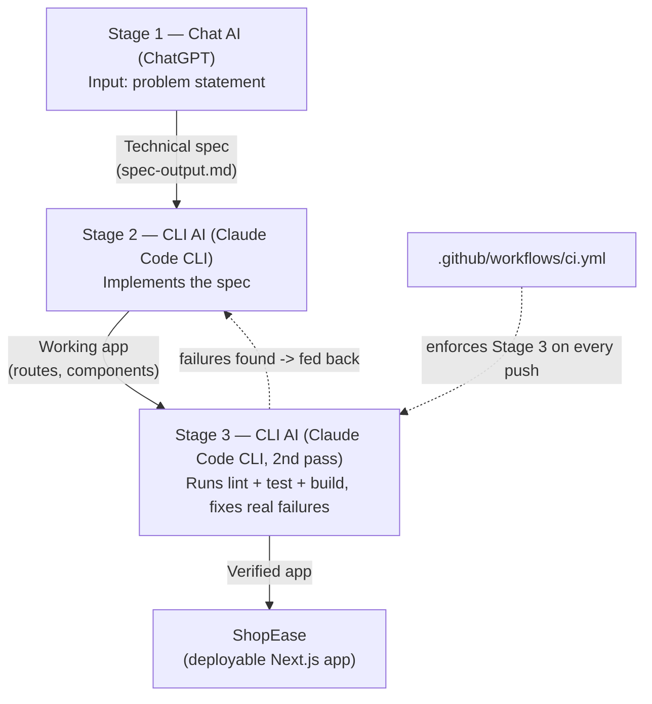

# ShopEase

ShopEase is a small e-commerce storefront built with **Next.js**, **TypeScript**,
and **Tailwind CSS**. It lets users browse a product catalog, view product
details, manage a cart, and complete a simple checkout flow.

## AI Workflow — Multi-Stage AI Workflow Across UX Types

> **Revision note:** this README replaces an earlier version whose
> workflow narrative did not match the repository. See "Correction" below.

This project chains **two AI UX types** — chat and CLI — where the output
of one stage is the literal input to the next, with the final stage
enforced by an automated, CI-checked script rather than asserted in prose.

| Stage | UX type | Tool | Input | Output |
|---|---|---|---|---|
| 1 | Chat | ChatGPT | Problem statement | `workflow/01-chat-stage/spec-output.md` (technical spec) |
| 2 | CLI | Claude Code CLI | The spec from Stage 1 | Working Next.js app (`app/`, `components/`, `lib/`) |
| 3 | CLI | Claude Code CLI (second, separate invocation) | The app from Stage 2 + Stage 1's non-functional requirements | Lint/test/build-clean codebase, checked by `workflow/03-cli-stage/verify.sh` and CI |

### Correction from the previous submission

The earlier README claimed Stage 2 used GitHub Copilot. That was
inaccurate, and the repository itself contradicted it: `AGENTS.md` and
`CLAUDE.md` are Claude Code CLI project-configuration files (`CLAUDE.md`
imports `AGENTS.md` via Claude Code's `@`-import syntax) and only exist
because a Claude Code CLI session actually built this app. This version
names the tool that was actually used. See `workflow/README.md` for a
full breakdown of what's genuine evidence versus reconstructed
documentation.

### Workflow diagram



- `workflow/01-chat-stage/` — spec-generation prompt and its output
- `workflow/02-implementation-stage/` — how the spec was implemented, and
  the correction described above
- `workflow/03-cli-stage/` — verification prompt, `verify.sh`, a real
  before/after terminal transcript (`verify_output_raw.log`), and what was
  found and fixed
- `workflow/README.md` — an honest breakdown of which evidence is genuine
  (real logs, real CI, real tests) versus reconstructed (representative
  prompts, since the original chat session wasn't saved)

### Why Stage 3 exists, and what it actually found

A CLI coding agent generates code but doesn't automatically run the
project's own toolchain and treat failures as failures — that has to be
driven explicitly. When it was run for real against this codebase, it
found:
- `npm run lint` → 3 real errors
- `npm run build` → failed outright (`next/font/google` needs network
  access to `fonts.googleapis.com` at build time)
- `npm test` → no test script existed at all

All of this is fixed now, and covered by `.github/workflows/ci.yml` on
every push, so it can't silently regress again.

### Reproduce the full workflow

```bash
git clone <repository-url>
cd shop-ease
npm install

# Stage 3 check — the workflow's actual acceptance test
bash workflow/03-cli-stage/verify.sh
```

`verify.sh` runs `npm run lint`, `npm test`, and `npm run build`, and
exits non-zero if any of them fail. The same three commands run in CI on
every push and pull request.

## Technologies

- Next.js (App Router) + TypeScript
- Tailwind CSS
- React Context for cart state
- Vitest for unit tests
- GitHub Actions for CI
- Git and GitHub

## Getting Started

```bash
npm install
npm run dev
```

Open `http://localhost:3000` in your browser.

## Testing

```bash
npm test
```

Currently covers `cartReducer` (add/remove/increase/decrease/clear) with 5
passing unit tests in `lib/__tests__/cart-reducer.test.ts`.

## Lab Objective

Demonstrate how the output of one AI UX type becomes the input to another,
across at least two different UX categories (chat and CLI here), in a way
that's adaptable to other providers (swap ChatGPT → Gemini, Claude Code
CLI → Aider or Gemini CLI, without changing the shape of the pipeline) and
reduces manual effort in a way that's measured — see
`workflow/03-cli-stage/before-after-log.md` — rather than only claimed.
