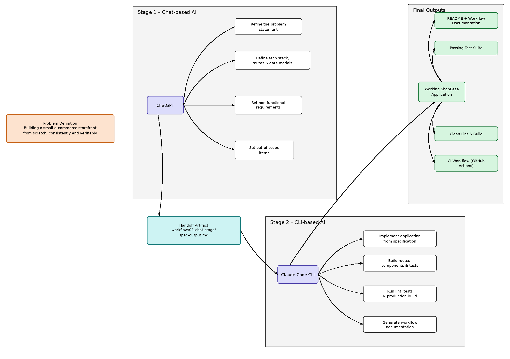

# ShopEase

ShopEase is a small e-commerce storefront built with **Next.js**, **TypeScript**,
and **Tailwind CSS**. It lets users browse a product catalog, view product
details, manage a cart, and complete a simple checkout flow.

## AI Workflow — Multi-Stage AI Workflow Across UX Types

This project chains **two AI UX types** — chat and CLI — where the output
of one stage is the literal input to the next, with the final stage
enforced by an automated, CI-checked script rather than asserted in prose.

| Stage | UX type | Tool | Prompt | Input | Output |
|---|---|---|---|---|---|
| 1 | Chat | ChatGPT | [01-chat-stage/prompt.md](workflow/01-chat-stage/prompt.md) | Problem statement | [spec-output.md](workflow/01-chat-stage/spec-output.md) (technical spec) |
| 2 | CLI | Claude Code CLI | [02-implementation-stage/notes.md](workflow/02-implementation-stage/notes.md) | The spec from Stage 1 | Working Next.js app ([app/](app/), [components/](components/), [lib/](lib/)) |
| 3 | CLI | Claude Code CLI (second, separate invocation) | [03-cli-stage/prompt.md](workflow/03-cli-stage/prompt.md) | The app from Stage 2 + Stage 1's non-functional requirements | Lint/test/build-clean codebase, checked by [verify.sh](workflow/03-cli-stage/verify.sh) and CI |

### The prompts

Every stage's exact prompt is checked in — read them in order to follow the
chain:

1. [Stage 1 prompt — spec generation (chat)](workflow/01-chat-stage/prompt.md)
   → [its output: `spec-output.md`](workflow/01-chat-stage/spec-output.md)
2. [Stage 2 notes — implementing the spec (CLI)](workflow/02-implementation-stage/notes.md)
3. [Stage 3 prompt — verification pass (CLI)](workflow/03-cli-stage/prompt.md)
   → [`verify.sh`](workflow/03-cli-stage/verify.sh),
   [before/after log](workflow/03-cli-stage/before-after-log.md),
   [raw terminal output](workflow/03-cli-stage/verify_output_raw.log)


### Workflow diagram



- [workflow/01-chat-stage/](workflow/01-chat-stage/) — spec-generation
  [prompt](workflow/01-chat-stage/prompt.md) and its
  [output](workflow/01-chat-stage/spec-output.md)
- [workflow/02-implementation-stage/](workflow/02-implementation-stage/) —
  [how the spec was implemented](workflow/02-implementation-stage/notes.md),
  and the correction described above
- [workflow/03-cli-stage/](workflow/03-cli-stage/) —
  [verification prompt](workflow/03-cli-stage/prompt.md),
  [`verify.sh`](workflow/03-cli-stage/verify.sh), a real before/after
  terminal transcript
  ([`verify_output_raw.log`](workflow/03-cli-stage/verify_output_raw.log)),
  and [what was found and fixed](workflow/03-cli-stage/before-after-log.md)
- [workflow/README.md](workflow/README.md) — an honest breakdown of which evidence is genuine
  (real logs, real CI, real tests) versus reconstructed (representative
  prompts, since the original chat session wasn't saved)

### Why Stage 3 exists, and what it actually found

A CLI coding agent generates code but doesn't automatically run the
project's own toolchain and treat failures as failures — that has to be
driven explicitly. When it was run for real against this codebase, it
found:
- `npm run lint` → 3 real errors
- `npm run build` → failed outright (`next/font/google` needs network
  access to `fonts.googleapis.com` at build time)
- `npm test` → no test script existed at all

All of this is fixed now, and covered by
[.github/workflows/ci.yml](.github/workflows/ci.yml) on every push, so it
can't silently regress again. The full diff of what changed is in the
[before/after log](workflow/03-cli-stage/before-after-log.md).

### Reproduce the full workflow

```bash
git clone https://github.com/Latiah/Multi-Stage_AI_Workflow.git
cd Multi-Stage_AI_Workflow
npm install

# Stage 3 check — the workflow's actual acceptance test
bash workflow/03-cli-stage/verify.sh
```

[`verify.sh`](workflow/03-cli-stage/verify.sh) runs `npm run lint`, `npm test`, and `npm run build`, and
exits non-zero if any of them fail. The same three commands run in CI on
every push and pull request.

## Technologies

- Next.js (App Router) + TypeScript
- Tailwind CSS
- React Context for cart state
- Vitest for unit tests
- GitHub Actions for CI
- Git and GitHub

## Getting Started

```bash
npm install
npm run dev
```

Open `http://localhost:3000` in your browser.

## Testing

```bash
npm test
```

Currently covers `cartReducer` (add/remove/increase/decrease/clear) with 5
passing unit tests in
[lib/__tests__/cart-reducer.test.ts](lib/__tests__/cart-reducer.test.ts).

